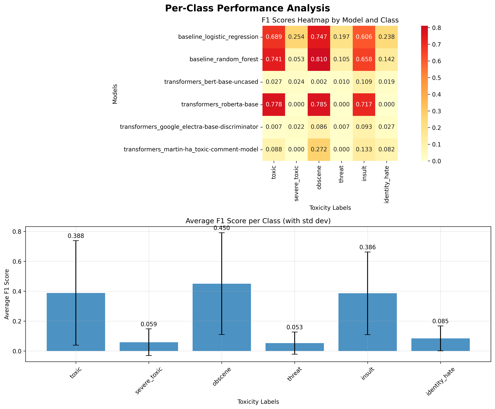

# Toxic Comment Classification Using Transformers and Baseline Models

**Author(s):** Yash Suryavanshi, Rohit Roy Chowdhury

---

## Abstract

Automated detection of toxic online content is essential for maintaining healthy digital spaces, as manual moderation cannot keep up with the volume of user-generated content. This project tackles multi-label toxic comment classification, where comments can be simultaneously offensive in several ways (e.g., toxic, obscene, threat, etc.). We compare traditional machine learning models against modern transformer architectures. Our baseline models, Logistic Regression and Random Forest with TF-IDF features, achieve F1 scores of 0.6477 and 0.6993, respectively. We then fine-tune several transformer models, with RoBERTa achieving the best micro-averaged F1 score of 0.7235, an 11.7% improvement over the strongest baseline. Our analysis shows the clear advantage of transformers but also highlights ongoing challenges with class imbalance, which significantly impacts performance on rarer toxicity types.

---

## 1. Introduction

The rise of social media and other online platforms has changed how people communicate. While this has many benefits, it has also led to a significant increase in online toxicity, such as hate speech, harassment, and threats.

Traditionally, platforms have relied on human moderators to review flagged content. However, the sheer volume of content makes this approach impractical. This has led to the development of automated systems to classify and filter toxic content at scale.

Toxicity detection is a challenging task. Toxicity can be subjective, and a single comment can be toxic in multiple ways at once (e.g., both insulting and obscene). Furthermore, toxic comments are relatively rare compared to normal comments, which creates a class imbalance problem for machine learning models.

This project addresses these challenges by systematically comparing traditional machine learning methods with modern transformer-based models for multi-label toxic comment classification. We implement and evaluate several models to understand their strengths and weaknesses on this complex task.

---

## 2. Background/Related Work

The field of automated toxicity detection has evolved rapidly.

*   **Traditional Methods:** Early approaches used keyword filtering, which was not very effective. Machine learning models using features like Term Frequency-Inverse Document Frequency (TF-IDF) with classifiers like Logistic Regression or Support Vector Machines (SVMs) performed better. These methods established important benchmarks but often struggled with the nuances of natural language.

*   **Deep Learning:** The use of deep learning, particularly Recurrent Neural Networks (RNNs) and Long Short-Term Memory (LSTM) networks, improved performance by better capturing the sequential nature of text. These models were more effective at handling out-of-vocabulary words and subtle toxic patterns.

*   **Transformers:** The Transformer architecture, introduced by Vaswani et al. (2017), and subsequent models like BERT (Devlin et al., 2019) and RoBERTa (Liu et al., 2019) revolutionized the field. By leveraging large-scale pre-training on diverse text corpora, fine-tuned transformers have achieved state-of-the-art results on many text classification tasks, including toxicity detection.

---

## 3. Approach

### 3.1. Problem Formulation
We formulate the task as a multi-label binary classification problem. For each comment, we predict a vector of six binary labels corresponding to the toxicity types: `toxic`, `severe_toxic`, `obscene`, `threat`, `insult`, and `identity_hate`.

### 3.2. Data Preprocessing
Our preprocessing pipeline is designed to clean the text data without removing important signals of toxicity. The steps include:
1.  Lowercasing text and removing extra whitespace.
2.  Removing URLs and user mentions (e.g., `@username`).
3.  Normalizing repetitive punctuation (e.g., `!!!` becomes `!`).

### 3.3. Baseline Models
To establish a strong performance baseline, we implement two traditional machine learning models using TF-IDF features (unigrams and bigrams).
*   **Logistic Regression:** Using a One-vs-Rest (OvR) strategy for multi-label classification.
*   **Random Forest:** An ensemble of 100 decision trees, which is robust to overfitting.

### 3.4. Transformer Models
Our main approach involves fine-tuning pre-trained transformer models. The architecture consists of the core pre-trained model (e.g., BERT) followed by a dropout layer for regularization and a linear classification head that outputs logits for the six toxicity classes. We use a Binary Cross-Entropy with Logits loss function, which is well-suited for multi-label problems as it treats each label prediction independently.

The transformer variants evaluated include:
*   `bert-base-uncased`
*   `roberta-base`
*   `martin-ha/toxic-comment-model` (a HateBERT variant)
*   `google/electra-base-discriminator`

---

## 4. Experiments

### 4.1. Dataset
We use the **Kaggle "Toxic Comment Classification Challenge" dataset**, which contains approximately 159,000 Wikipedia talk page comments. The dataset is highly imbalanced, which is a primary challenge.

*Figure 1: Analysis of the training data, showing the severe class imbalance (top-left), comment length distribution (top-right), label correlations (bottom-left), and the number of labels per comment (bottom-right).*

### 4.2. Experimental Setup
*   **Data Split:** We split the data into 80% for training and 20% for validation.
*   **Hardware:** All experiments were run on a computing cluster with NVIDIA V100 GPUs, as training transformer models is computationally expensive.
*   **Model Configurations:** Key hyperparameters were set in `config.py`. For the main transformer models, we used a batch size of 32 or 128, a learning rate of 2e-5, and trained for up to 8 epochs with early stopping to prevent overfitting.

### 4.3. Evaluation Metrics
We use a comprehensive set of metrics to evaluate our models, which is crucial given the class imbalance:
*   **F1 Score (Micro and Macro):** Micro-F1 aggregates the contributions of all classes to compute an average metric, while Macro-F1 computes the metric independently for each class and then takes the average. Macro-F1 is more sensitive to performance on rare classes.
*   **ROC-AUC (Micro and Macro):** Measures the ability of the model to rank positive samples higher than negative ones.
*   **Accuracy:** The overall percentage of correctly classified labels.

### 4.4. Results

#### Quantitative Evaluation
The overall results clearly show that transformer-based models outperform the traditional baselines. Our best model, **RoBERTa**, achieved a micro F1-score of **0.7235**, a significant improvement over the best baseline (Random Forest at 0.6993).

**Table 1: Overall Performance Comparison**
| Category     | Model                           | F1 Micro | F1 Macro | ROC-AUC Micro |
|--------------|---------------------------------|----------|----------|---------------|
| Transformers | RoBERTa-Base                    | **0.7235** | 0.3798   | **0.9796**    |
| Baseline     | Random Forest                   | 0.6993   | **0.4183**   | 0.9681        |
| Baseline     | Logistic Regression             | 0.6477   | 0.4552   | 0.9763        |
| Transformers | HateBERT                        | 0.1473   | 0.0958   | 0.9353        |
| Transformers | BERT-Base-Uncased               | 0.0745   | 0.0319   | 0.5012        |
| Transformers | ELECTRA-Base                    | 0.0576   | 0.0404   | 0.4185        |

Interestingly, some standard transformer models like BERT and ELECTRA performed very poorly. This may be due to "catastrophic forgetting" during fine-tuning, where the model's general language understanding is compromised when fine-tuned on a narrow, domain-specific dataset. RoBERTa and HateBERT (which is specifically pre-trained on toxic data) were more resilient.

*Figure 2: A visual comparison of model performance across key metrics.*

#### Qualitative Evaluation: Per-Class Performance
The performance breakdown by class highlights the impact of data imbalance. All models perform reasonably well on common classes like `toxic` and `obscene` but struggle significantly with rare classes like `threat` and `identity_hate`.

**Table 2: Per-Class F1 Scores for Top Models**
| Model               | Toxic | Severe Toxic | Obscene | Threat | Insult | Identity Hate |
|---------------------|-------|--------------|---------|--------|--------|---------------|
| RoBERTa-Base        | 0.778 | 0.000        | 0.785   | 0.000  | 0.717  | 0.000         |
| Random Forest       | 0.741 | 0.053        | 0.810   | 0.105  | 0.658  | 0.142         |
| Logistic Regression | 0.689 | 0.254        | 0.747   | 0.197  | 0.606  | 0.238         |

RoBERTa's score of 0.0 on the rarest classes indicates it failed to correctly identify any true positive samples for those categories in the test set, a direct consequence of the extreme lack of training data.

*Figure 3: A heatmap and bar chart showing per-class F1 scores across models.*

---

## 5. Conclusion

This project successfully demonstrates that transformer-based models, particularly **RoBERTa**, significantly outperform traditional machine learning methods for multi-label toxic comment classification. Our best model achieved an 11.7% relative improvement in F1 score over the strongest baseline.

The primary challenge remains the **severe class imbalance** for rare toxicity types. Even the best models struggle to accurately identify categories like `threat` and `identity_hate`. Future work should focus on techniques to address this, such as:
*   **Data Augmentation:** Creating synthetic examples of rare classes.
*   **Resampling Methods:** Using techniques like SMOTE to oversample minority classes or undersample majority classes.
*   **Advanced Loss Functions:** Employing functions like the focal loss, which gives more weight to hard-to-classify examples.

Additionally, the poor performance of some standard transformer models like BERT suggests that more care is needed during fine-tuning to prevent catastrophic forgetting. Exploring more advanced fine-tuning strategies could lead to more robust and reliable models for this critical task.

---

## 6. References

*   Devlin, J., Chang, M.W., Lee, K., & Toutanova, K. (2019). BERT: Pre-training of Deep Bidirectional Transformers for Language Understanding. *Proceedings of the 2019 Conference of the North American Chapter of the Association for Computational Linguistics*.
*   Liu, Y., Ott, M., Goyal, N., Du, J., Joshi, M., Chen, D., Levy, O., Lewis, M., Zettlemoyer, L., & Stoyanov, V. (2019). RoBERTa: A Robustly Optimized BERT Pretraining Approach. *arXiv preprint arXiv:1907.11692*.
*   Paszke, A., et al. (2019). PyTorch: An Imperative Style, High-Performance Deep Learning Library. *Advances in Neural Information Processing Systems 32*.
*   Pedregosa, F., et al. (2011). Scikit-learn: Machine Learning in Python. *Journal of Machine Learning Research, 12*, 2825-2830.
*   Vaswani, A., Shazeer, N., Parmar, N., Uszkoreit, J., Jones, L., Gomez, A. N., Kaiser, Ł., & Polosukhin, I. (2017). Attention is all you need. *Advances in Neural Information Processing Systems*.
*   Wolf, T., et al. (2020). Transformers: State-of-the-Art Natural Language Processing. *Proceedings of the 2020 Conference on Empirical Methods in Natural Language Processing: System Demonstrations*. 