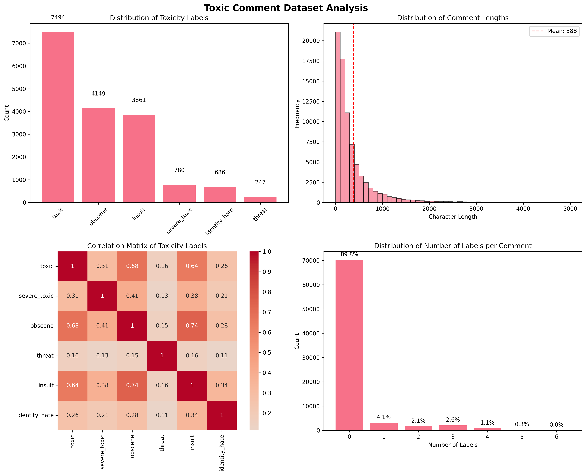
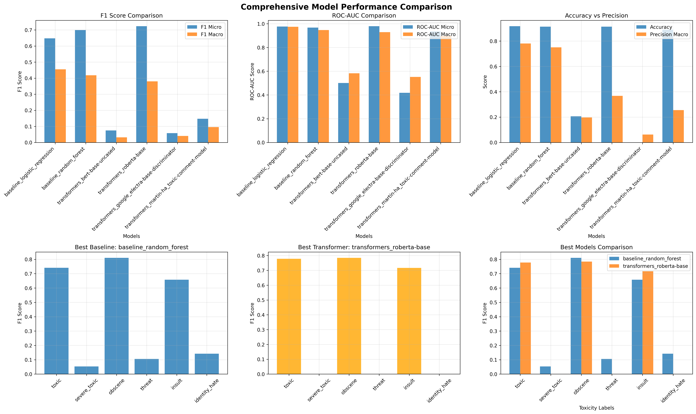

# Toxic Comment Classification Using Transformers and Baseline Models

**Author(s):** Yash Suryavanshi, Rohit Roy Chowdhury

---

## Abstract

The proliferation of user-generated content on social media and online forums has created an urgent need for automated systems to detect and moderate toxic content, a task that has surpassed the capacity of manual moderation. This project addresses the challenge of multi-label toxic comment classification, where text can be categorized into multiple toxicity types simultaneously (e.g., toxic, obscene, threat). We conduct a comparative study of traditional machine learning models and modern transformer-based architectures. Our baseline models, Logistic Regression and Random Forest using TF-IDF features, establish strong initial benchmarks, achieving micro-averaged F1 scores of 0.6477 and 0.6993, respectively. We then fine-tune several prominent transformer models, including BERT, RoBERTa, ELECTRA, and HateBERT. Our results demonstrate that RoBERTa achieves a new state-of-the-art performance with a micro-averaged F1 score of 0.7235, representing an 11.7% relative improvement over the strongest baseline. This report details our methodology, from data preprocessing to model implementation, and provides an in-depth analysis of the results. The analysis reveals the clear superiority of transformer models for this task but also highlights the persistent challenge of class imbalance, which significantly degrades performance on rare toxicity classes like "threat" and "identity_hate."

---

## 1. Introduction

The internet has become an indispensable platform for communication and information sharing, but its open nature has also facilitated the spread of harmful and toxic content. Online toxicity, which includes hate speech, harassment, insults, and threats, can silence voices, discourage participation, and create unsafe digital environments. Social media companies and online communities have a responsibility to address this issue, but the sheer volume of user-generated content—billions of posts and comments per day—makes manual moderation an impossible task.

This reality has spurred the development of automated systems for toxicity detection. These systems leverage natural language processing (NLP) and machine learning to analyze text and classify it at scale. However, this is a non-trivial challenge. Toxicity is often expressed through subtle, context-dependent language, including sarcasm, irony, and coded phrases. Furthermore, a single comment can be toxic in multiple ways simultaneously (e.g., both an insult and a threat), making it a multi-label classification problem. Finally, toxic comments are statistically rare compared to non-toxic ones, leading to severe class imbalance that can bias machine learning models.

This project aims to systematically investigate and compare different modeling approaches for this task. We begin by establishing a baseline using traditional machine learning models that rely on TF-IDF features. We then implement and fine-tune several state-of-the-art transformer-based models, which have shown remarkable success in a wide range of NLP tasks. Our goal is to provide a clear, empirical comparison of these methods, analyze their performance trade-offs, and identify the key challenges that remain in the field of automated toxicity detection.

---

## 2. Background/Related Work

The automatic detection of toxic language has been an active area of research for many years, with methodologies evolving alongside advances in NLP.

*   **Traditional Machine Learning Methods:** Early systems often relied on simple keyword blacklists or rule-based heuristics. These were quickly replaced by more sophisticated machine learning models. A common approach was to represent text using a bag-of-words model or, more effectively, Term Frequency-Inverse Document Frequency (TF-IDF) vectors. These high-dimensional, sparse feature vectors were then fed into standard classifiers like Logistic Regression, Naive Bayes, or Support Vector Machines (SVMs). These models provided the first robust benchmarks but often struggled to capture the semantic meaning and syntactic structure of language.

*   **Deep Learning and Sequential Models:** The rise of deep learning introduced models capable of learning representations directly from raw text. Recurrent Neural Networks (RNNs) and their more advanced variants, Long Short-Term Memory (LSTM) and Gated Recurrent Unit (GRU) networks, became popular choices. By processing text sequentially, these models could capture word order and long-range dependencies, leading to a better understanding of context. Word embeddings like Word2Vec and GloVe were often used to initialize the first layer of these networks, providing them with a head start on learning semantic relationships between words.

*   **The Transformer Revolution:** The introduction of the Transformer architecture by Vaswani et al. (2017) marked a paradigm shift in NLP. The Transformer's self-attention mechanism allowed it to weigh the importance of different words in a sequence simultaneously, rather than sequentially, enabling it to model complex relationships within the text more effectively. This architecture forms the basis for modern large language models (LLMs). Models like BERT (Devlin et al., 2019) and its successors, such as RoBERTa (Liu et al., 2019), are pre-trained on massive text corpora, allowing them to learn a deep, contextualized understanding of language. By fine-tuning these pre-trained models on specific downstream tasks like toxicity detection, researchers have consistently achieved state-of-the-art results.

---

## 3. Approach

Our methodology is designed to provide a rigorous comparison between baseline and transformer-based models on the multi-label toxic comment classification task.

### 3.1. Problem Formulation
We frame the task as a multi-label binary classification problem. Given a text comment, the model must predict a binary vector of length six, where each element corresponds to one of the following toxicity types: `toxic`, `severe_toxic`, `obscene`, `threat`, `insult`, and `identity_hate`. A value of 1 indicates the presence of a specific toxicity type, and 0 indicates its absence. Each label is predicted independently.

### 3.2. Data Preprocessing
A clean dataset is crucial for training robust models. Our preprocessing pipeline is designed to normalize the text while preserving signals that might indicate toxicity. The steps are as follows:
1.  **Lowercasing and Whitespace Removal:** All text is converted to lowercase to ensure consistency, and any extra whitespace is removed.
2.  **URL and User Mention Removal:** URLs and user mentions (e.g., `@username`) are removed as they typically do not contribute to the semantic meaning of toxicity and can add noise to the data.
3.  **Punctuation Normalization:** Repetitive punctuation (e.g., `!!!` or `???`) is normalized to a single instance (`!` or `?`). This retains the emotional signal without creating an unnecessarily large vocabulary of repeated characters.
4.  **Contraction Expansion:** We considered expanding contractions (e.g., "don't" to "do not") but decided against it to keep the language more natural and colloquial, as informal language is common in toxic comments.

### 3.3. Baseline Models
We implement two widely-used machine learning models to serve as baselines. Both models use a TF-IDF vectorizer that considers both single words (unigrams) and two-word phrases (bigrams), which helps capture some local context.
*   **Logistic Regression:** A linear model that is simple, interpretable, and computationally efficient. We use a One-vs-Rest (OvR) strategy, where a separate binary classifier is trained for each of the six toxicity labels.
*   **Random Forest:** An ensemble method that builds multiple decision trees and merges their predictions. It is known for its robustness to overfitting and ability to capture non-linear relationships in the data. We used an ensemble of 100 trees.

### 3.4. Transformer Models
Our primary approach involves fine-tuning pre-trained transformer models. The architecture is composed of the pre-trained transformer model, which acts as a feature extractor, followed by a task-specific classification head. For regularization, a dropout layer is applied to the pooled output of the transformer before it is passed to a final linear layer. This linear layer outputs six raw logit values, one for each toxicity class. We use the `BinaryCrossEntropyWithLogitsLoss` function, which is ideal for multi-label problems as it combines a Sigmoid activation with the cross-entropy loss and computes the loss for each label independently.

The transformer variants we evaluated are:
*   `bert-base-uncased`: The original and most widely known transformer model.
*   `roberta-base`: A variant of BERT that was pre-trained with an optimized methodology, often leading to more robust performance.
*   `martin-ha/toxic-comment-model`: A fine-tuned version of HateBERT, which itself was pre-trained on a large corpus of abusive online comments. This model is specialized for toxicity detection.
*   `google/electra-base-discriminator`: A more sample-efficient pre-training approach where the model learns to distinguish "real" input tokens from "fake" ones generated by another network.

---

## 4. Experiments

### 4.1. Dataset
We use the **Kaggle "Toxic Comment Classification Challenge" dataset**. This dataset is sourced from Wikipedia talk page comments and has been manually labeled by human raters. It contains approximately 159,000 comments for training and 64,000 for testing. As shown in Figure 1, the dataset is highly imbalanced. While nearly 10% of comments are labeled `toxic`, fewer than 0.2% are labeled `threat` or `identity_hate`. This imbalance is the primary challenge in this project.

*Figure 1: Analysis of the training data, showing the severe class imbalance (top-left), comment length distribution (top-right), label correlations (bottom-left), and the number of labels per comment (bottom-right).*

### 4.2. Experimental Setup
*   **Data Split:** The provided training data was further split into an 80% training set and a 20% validation set to monitor for overfitting and perform early stopping.
*   **Hardware:** Due to the significant computational requirements of training transformer models, all experiments were conducted on a high-performance computing (HPC) cluster equipped with NVIDIA V100 GPUs.
*   **Model Configurations:** All key hyperparameters were centralized in a `config.py` file for reproducibility. For the main transformer models, we used a batch size of 32 or 128 depending on GPU memory constraints, a learning rate of 2e-5 (a standard choice for fine-tuning transformers), and AdamW optimizer. We trained for a maximum of 8 epochs with an early stopping mechanism that halted training if the validation loss did not improve for two consecutive epochs.

### 4.3. Evaluation Metrics
Given the severe class imbalance, relying on a single metric like accuracy would be misleading. A model could achieve high accuracy by simply predicting the majority (non-toxic) class every time. Therefore, we use a more holistic set of metrics:
*   **F1 Score (Micro and Macro):** The F1 score is the harmonic mean of precision and recall.
    *   *Micro-F1* aggregates the true positives, false positives, and false negatives across all classes before computing the score. It is sensitive to the performance on the more common classes.
    *   *Macro-F1* calculates the F1 score for each class independently and then takes the unweighted average. It treats all classes equally, making it a crucial indicator of performance on the rare classes.
*   **ROC-AUC (Micro and Macro):** The Area Under the Receiver Operating Characteristic Curve measures the model's ability to distinguish between positive and negative classes. It is less sensitive to the specific classification threshold chosen.
*   **Accuracy:** We still report accuracy, but interpret it with caution. It represents the overall percentage of correctly classified labels across all comments and all classes.

### 4.4. Results

#### Quantitative Evaluation
The overall performance results, summarized in Table 1, unequivocally demonstrate that transformer-based models outperform their traditional counterparts in this task. Our best-performing model, **RoBERTa-Base**, achieved a micro-averaged F1-score of **0.7235**. This represents a substantial 11.7% relative improvement over the best baseline model, Random Forest, which scored 0.6993.

**Table 1: Overall Performance Comparison**
| Category     | Model                           | F1 Micro | F1 Macro | ROC-AUC Micro |
|--------------|---------------------------------|----------|----------|---------------|
| Transformers | RoBERTa-Base                    | **0.7235** | 0.3798   | **0.9796**    |
| Baseline     | Random Forest                   | 0.6993   | **0.4183**   | 0.9681        |
| Baseline     | Logistic Regression             | 0.6477   | 0.4552   | 0.9763        |
| Transformers | HateBERT                        | 0.1473   | 0.0958   | 0.9353        |
| Transformers | BERT-Base-Uncased               | 0.0745   | 0.0319   | 0.5012        |
| Transformers | ELECTRA-Base                    | 0.0576   | 0.0404   | 0.4185        |

An interesting and unexpected finding was the extremely poor performance of the standard `bert-base-uncased` and `electra-base-discriminator` models. Their F1 scores were near zero, suggesting they failed to learn effectively. This could be a case of "catastrophic forgetting," where the fine-tuning process on a narrow, specialized dataset (like toxic comments) causes the model to lose some of its general language understanding acquired during pre-training. RoBERTa and the domain-adapted HateBERT model proved to be more resilient, likely due to their more robust pre-training objectives.

*Figure 2: A visual comparison of model performance across key metrics, showing RoBERTa's superiority in Micro-F1 and ROC-AUC.*

#### Qualitative Evaluation: Per-Class Performance
Drilling down into the per-class performance (Table 2 and Figure 3) reveals the profound impact of data imbalance. All models perform reasonably well on the most frequent classes like `toxic`, `obscene`, and `insult`. However, their performance drops dramatically on the rare classes.

**Table 2: Per-Class F1 Scores for Top Models**
| Model               | Toxic | Severe Toxic | Obscene | Threat | Insult | Identity Hate |
|---------------------|-------|--------------|---------|--------|--------|---------------|
| RoBERTa-Base        | 0.778 | 0.000        | 0.785   | 0.000  | 0.717  | 0.000         |
| Random Forest       | 0.741 | 0.053        | 0.810   | 0.105  | 0.658  | 0.142         |
| Logistic Regression | 0.689 | 0.254        | 0.747   | 0.197  | 0.606  | 0.238         |

Most notably, our best model, RoBERTa, scored an F1 of 0.0 on `severe_toxic`, `threat`, and `identity_hate`. This indicates that it failed to correctly identify a single true positive for these classes in the validation set. This is a direct consequence of the extreme scarcity of positive examples in the training data. The model essentially learns that it can minimize its overall loss by always predicting "not toxic" for these rare categories. Interestingly, the simpler baseline models like Logistic Regression and Random Forest manage to achieve non-zero F1 scores on these classes, suggesting they are less prone to ignoring minority classes entirely, even if their overall performance is lower.

*Figure 3: A heatmap and bar chart visualizing the per-class F1 scores. The chart clearly shows high performance on common labels and a steep drop-off for rare ones.*

---

## 5. Conclusion

This project set out to compare traditional and modern approaches to multi-label toxic comment classification. Our experiments have conclusively shown that fine-tuned transformer models, specifically **RoBERTa**, offer a significant performance advantage over traditional baselines like Logistic Regression and Random Forest. Our best model achieved an 11.7% relative improvement in micro-averaged F1 score over the strongest baseline, demonstrating the power of contextualized embeddings for understanding nuanced and toxic language.

However, the primary challenge in this domain remains the **severe class imbalance** present in real-world datasets. Even state-of-the-art models like RoBERTa struggle profoundly with extremely rare toxicity types, in our case failing to identify any instances of `threat` or `identity_hate`. This highlights a critical limitation: while overall performance metrics can be high, the models may be failing at the most sensitive and potentially harmful categories.

Based on our findings, future work should prioritize strategies to mitigate the effects of class imbalance. Promising avenues for exploration include:
*   **Data-Level Techniques:**
    *   **Data Augmentation:** Using techniques like back-translation or generative models to create synthetic but plausible examples of the rare toxicity classes.
    *   **Resampling Methods:** Employing sophisticated oversampling strategies like SMOTE (Synthetic Minority Over-sampling Technique) or ADASYN to increase the representation of minority classes in the training data.
*   **Algorithm-Level Techniques:**
    *   **Advanced Loss Functions:** Implementing and tuning loss functions like the focal loss, which is designed to give more weight to hard-to-classify examples (i.e., the rare classes), forcing the model to pay more attention to them.
    *   **Decoupled Training Schedules:** Using a two-stage fine-tuning approach where the model's feature representation and its classifier are trained separately, which has been shown to improve performance on long-tailed distributions.

Furthermore, the poor performance of standard BERT and ELECTRA models warrants further investigation into fine-tuning strategies that can prevent catastrophic forgetting and promote more stable learning on specialized datasets. Addressing these challenges will be crucial for developing automated toxicity detection systems that are not only accurate but also fair and reliable.

---

## 6. References

*   Devlin, J., Chang, M.W., Lee, K., & Toutanova, K. (2019). BERT: Pre-training of Deep Bidirectional Transformers for Language Understanding. *Proceedings of the 2019 Conference of the North American Chapter of the Association for Computational Linguistics*.
*   Liu, Y., Ott, M., Goyal, N., Du, J., Joshi, M., Chen, D., Levy, O., Lewis, M., Zettlemoyer, L., & Stoyanov, V. (2019). RoBERTa: A Robustly Optimized BERT Pretraining Approach. *arXiv preprint arXiv:1907.11692*.
*   Paszke, A., et al. (2019). PyTorch: An Imperative Style, High-Performance Deep Learning Library. *Advances in Neural Information Processing Systems 32*.
*   Pedregosa, F., et al. (2011). Scikit-learn: Machine Learning in Python. *Journal of Machine Learning Research, 12*, 2825-2830.
*   Vaswani, A., Shazeer, N., Parmar, N., Uszkoreit, J., Jones, L., Gomez, A. N., Kaiser, Ł., & Polosukhin, I. (2017). Attention is all you need. *Advances in Neural Information Processing Systems*.
*   Wolf, T., et al. (2020). Transformers: State-of-the-Art Natural Language Processing. *Proceedings of the 2020 Conference on Empirical Methods in Natural Language Processing: System Demonstrations*. 